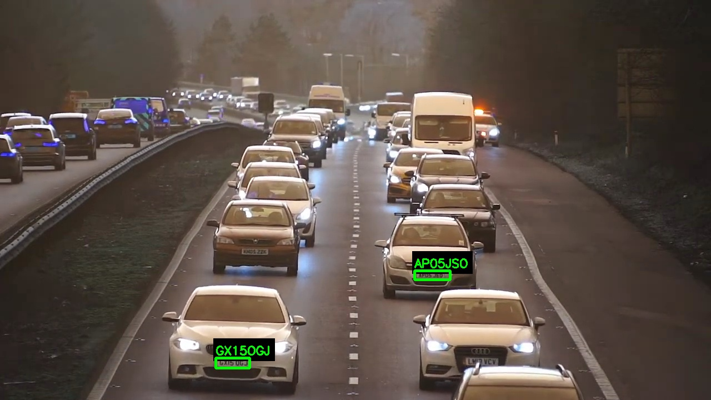
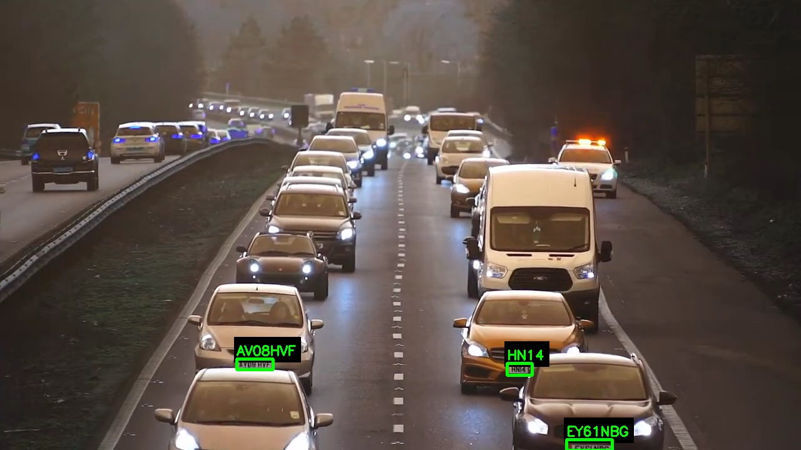
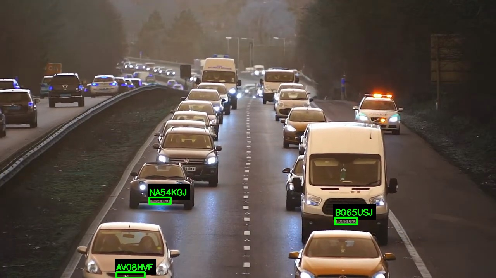
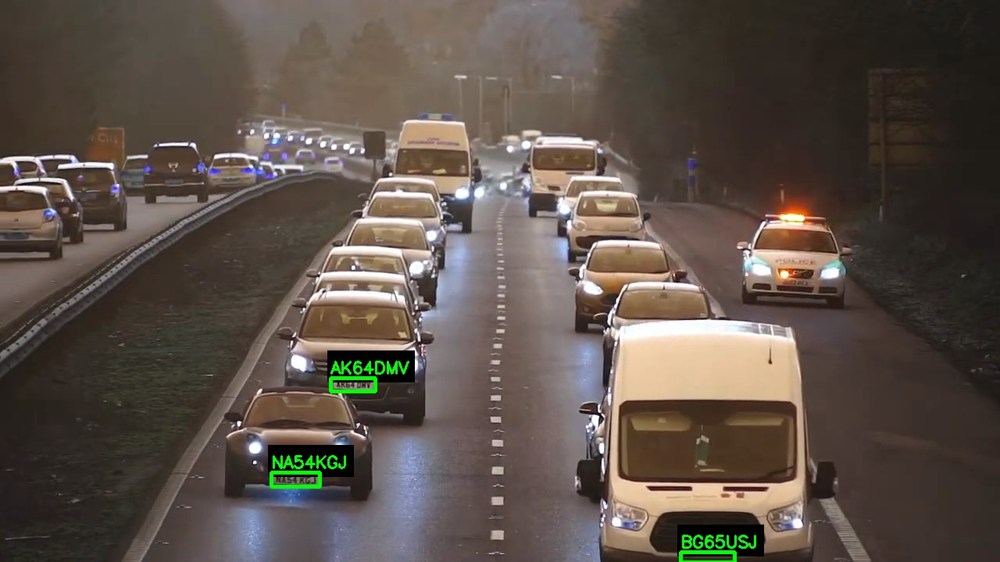
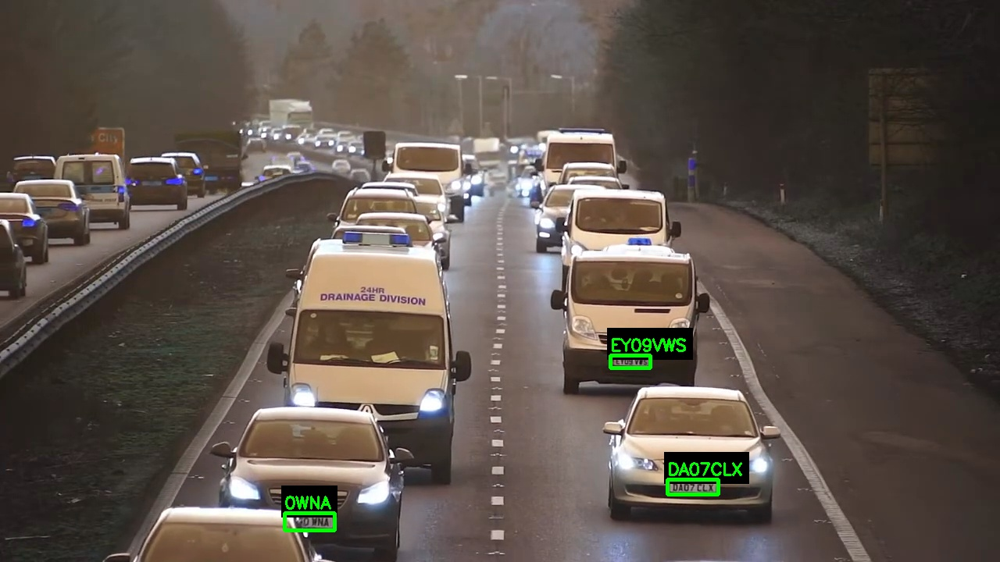

# ANPR — Bright Node

Automatic license-plate recognition for video: upload a clip, pick a plate region, and get every
plate the pipeline detects and reads, with an annotated video you can download.

**Pipeline:** YOLOv8 plate detector → [fast-plate-ocr](https://github.com/ankandrew/fast-plate-ocr)
(`cct-s-v2-global-model`, ONNX, CPU) → temporal voting/locking → region-aware validation
(USA / UK / Hong Kong / Universal).

## Screenshots

Annotated frames from the pipeline processing highway footage — each detected plate is boxed,
read, and labeled in real time:

<p>
  
  
</p>
<p>
  
  
</p>
<p>
  
  
</p>

## Stack

- **Backend:** FastAPI, async background jobs (upload → poll progress → fetch results/video).
- **Frontend:** hand-built HTML/CSS/JS matching the Bright Node design system (`theme.css`).
- **Compute:** CPU-only (`imgsz=960`, `frame_stride=2` by default — see Phase 0 benchmark notes
  below for why).
- **Deploy:** [Modal](https://modal.com), served via `@modal.asgi_app`.

## Local setup

```bash
python -m venv .venv
.venv\Scripts\activate          # Windows
pip install --index-url https://download.pytorch.org/whl/cpu torch==2.13.0 torchvision==0.28.0
pip install -r requirements.txt
```

Place `best_carplateocr_30062026.pt` (the trained YOLOv8 weights) in the repo root — it's not
committed to git.

```bash
python -m uvicorn app.main:app --reload
```

Open `http://127.0.0.1:8000`.

## API

| Route | Method | Purpose |
|---|---|---|
| `/api/jobs` | POST | Upload a video (`file`) + `region` (`US`/`UK`/`HK`/`AUTO`) → `{job_id}` |
| `/api/jobs/{id}` | GET | Poll status/progress; includes `result` + `video_url` + `thumb_urls` once done |
| `/api/jobs/{id}/video` | GET | Download the annotated video |
| `/api/jobs/{id}/thumb/{n}` | GET | Annotated-frame thumbnail |

## CPU performance notes

On this project's reference machine, `imgsz=1920` (the pipeline's original default, tuned for GPU)
took ~4.5s/frame on CPU — impractical for a web app. `imgsz=960` with `frame_stride=2` cut that to
~0.7s/frame with no loss in detected plates versus `frame_stride=1`, so that's the backend default
(`app/jobs.py`). `anpr.py` itself keeps its original defaults for CLI/notebook parity.

## Project layout

```
anpr.py            core recognition pipeline (detector, OCR, stabilizer, region validation)
app/                FastAPI backend (jobs.py: job store + processing; main.py: routes)
frontend/           static UI (index.html, app.js, theme.css, logo assets)
modal_app.py        Modal deployment entrypoint
```
